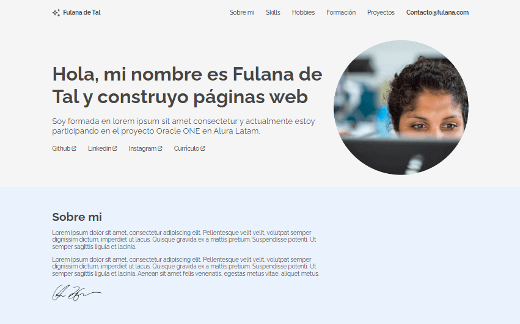

# Challenge ONE | Frontend - Portafolio 🧑

</img>
  <h3>
    <a href="https://blackpachamame.github.io/desafios-alura/portfolio/">
      🙊 Sitio en vivo
    </a>
     | 
    <a href="https://mega.nz/file/kF1E1ThC#pOCI1pd4zuTTJDgqqnmdhJpJOUnepB1wgrOn0ALpTjQ">
      Descargar plantilla 📥
    </a>
  </h3>

## Requisitos 📌

En esta sprint, vamos a trabajar en la construcción de un Portafolio, para que puedas mostrar tus proyectos a posibles reclutadores.

-   Debe tener un menú de navegación.
-   Debe tener una imagen que se utilizará como banner.
-   Debe contener una sección sobre mí.
    
    -   Debe tener una foto de perfil.
    -   Debe incluir enlaces a sus redes sociales.
    -   Debe tener sus datos personales:
        
         1) Nombre
         2) Edad
         3) Nacionalidad
         4) Biografía
        
-   Debe tener una sección de Hobbies y Soft Skills. Por ejemplo:  
	   - Pasatiempos: actividades que disfruta hacer.  
	   - Habilidades blandas: comunicación, liderazgo, empatía…
-   Debe tener una sección de formación y cursos.  
    Aquí puedes poner las formaciones y cursos que has realizado, aunque no esté en el área de programación.
-   Debe tener experiencia en la sección de programación.  
    Aquí puedes poner los proyectos que ya has realizado anteriormente, como, por ejemplo: los proyectos del retador principiante en programación.
-   Debe tener un formulario de contacto con los siguientes campos:
    
     1) Correo electrónico
     2) Nombre
     3) Asunto
     4) Mensaje
    
-   Debe tener un Footer con la información de la persona que desarrolló el portafolio.
-   Es de extrema importancia que el portafolio sea responsivo, lo que quiere decir que debe adaptarse a los diferentes tamaños de pantallas, pudiendo ser desktop, tablet o celular.

## Extras ➕

- La página debe contener un botón que le permita ver, en una nueva pestaña, una versión PDF de su currículum.

## Correcciones ✏️

- Corrección del `index.html`, se encontraron errores de semántica y de sintaxis.
- Se reemplazaron la mayoría de las imágenes por iconos de fontawesome.
- El resto de las imágenes fueron actualizadas y optimizadas.

## Recursos útiles 📚

- [Fontawesome](https://fontawesome.com) - Iconos gratis.
- [Get Emoji](https://getemoji.com) - ✂️ Copy and 📋 Paste Emoji 👍.
- [TinyPNG](https://tinypng.com) - Optimizar imágenes.
